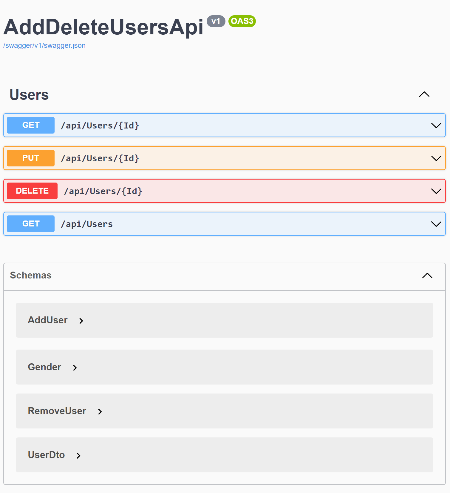
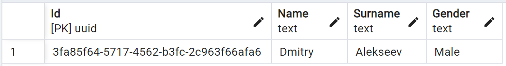
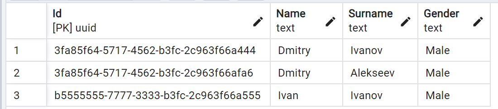
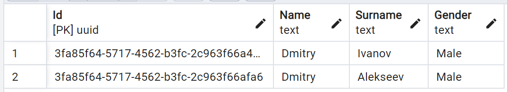

# AddDeleteUsers API

This API provides functionality to manage users by performing operations such as adding, deleting, and finding users by name. It supports the following requests:



## 1. Get User

### Request

- Method: GET
- Endpoint: `/api/Users/{Id}`

### Description

Retrieves information about a specific user based on their unique `Id`.

### Parameters

- `Id` (required): The unique identifier of the user.

### Response

- Status Code: 200 (OK)
- Body: JSON object containing the user's information.
### Example

**DataBase**: 

**Request Id:** 3fa85f64-5717-4562-b3fc-2c963f66afa6

**Response:**
```json
{
  "id": "3fa85f64-5717-4562-b3fc-2c963f66afa6",
  "name": "Dmitry",
  "surname": "Alekseev",
  "gender": 0
}
```

## 2. Put User

### Request

- Method: PUT
- Endpoint: `/api/Users/{Id}`

### Description

Puts new user or Updates the information of a specific user based on their unique `Id`.

### Parameters

- `Id` (required): The unique identifier of the user.

### Request Body

- JSON object containing the updated user information.

### Response

- Status Code: 200 (OK)
- Body: JSON object containing the updated user's information.

### Example

**Database before:** Empty

**Request Id:** 3fa85f64-5717-4562-b3fc-2c963f66afa6

**Request body:**
```json
{
  "id": "3fa85f64-5717-4562-b3fc-2c963f66afa6",
  "name": "Dmitry",
  "surname": "Alekseev",
  "gender": 0
}
```
**DataBase after**: 


## 3. Delete User

### Request

- Method: DELETE
- Endpoint: `/api/Users/{Id}`

### Description

Deletes a specific user based on their unique `Id`.

### Parameters

- `Id` (required): The unique identifier of the user.

### Response

- Status Code: 200 (OK)

### Example

**Database before:**


**Request Id:** b5555555-7777-3333-b3fc-2c963f66a55

**DataBase after**: 


## 4. Find User by Name

### Request

- Method: GET
- Endpoint: `/api/Users`

### Description

Finds users based on their name.

### Parameters

- `Name` (required): The name of the user to search for.

### Response

- Status Code: 200 (OK)
- Body: JSON array containing the matching user(s) information.

### Example

**Database:**


**Request Name:** Dmitry

**Response esponse**: 
```json
[
  {
    "id": "3fa85f64-5717-4562-b3fc-2c963f66afa6",
    "name": "Dmitry",
    "surname": "Alekseev",
    "gender": 0
  },
  {
    "id": "3fa85f64-5717-4562-b3fc-2c963f66a444",
    "name": "Dmitry",
    "surname": "Ivanov",
    "gender": 0
  }
]
```